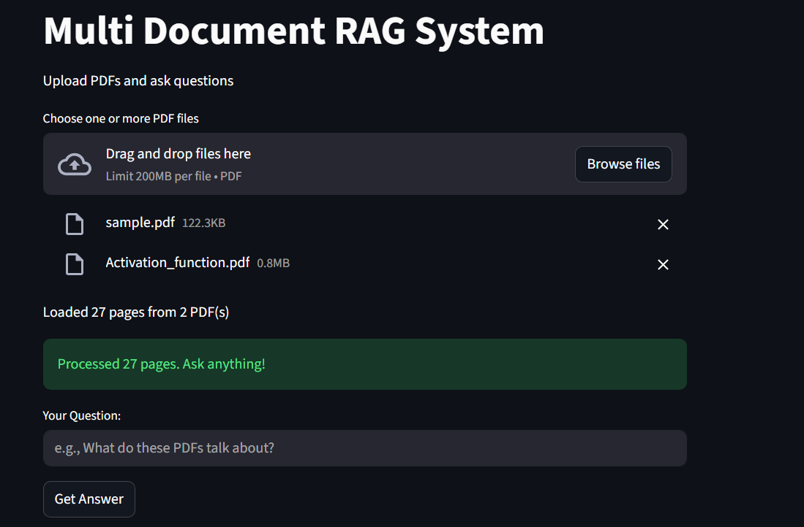
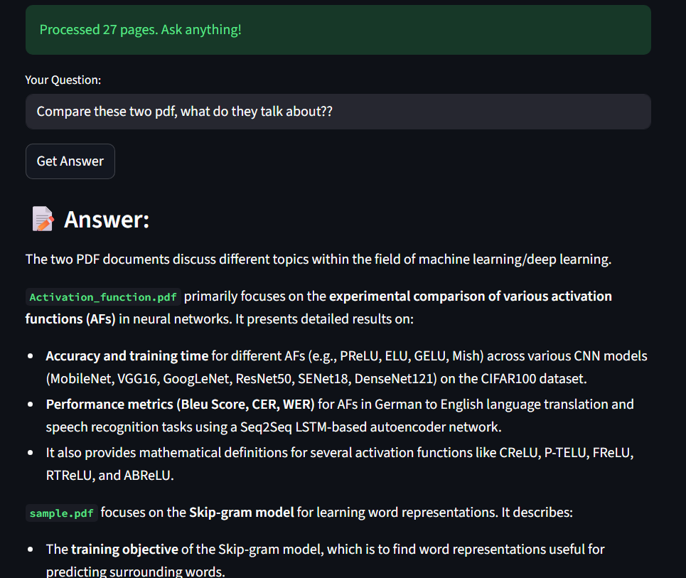
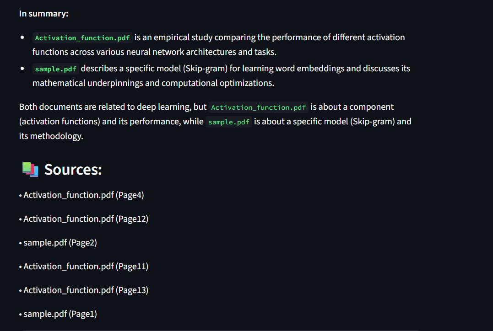

# Multi-Document RAG System

A Retrieval-Augmented Generation (RAG) system that allows users to upload multiple PDF documents and ask questions across all documents, with source citations showing exactly which documents and pages each answer came from.

##  Features

- **Multi-document support**: Upload and query multiple PDFs simultaneously
- **Source citations**: Every answer includes references to source documents and page numbers
- **Clean UI**: Intuitive Streamlit interface with drag-and-drop file upload
- **Scalable retrieval**: Uses vector embeddings (ChromaDB) for efficient document search
- **API-based LLM**: Integrated with [OpenAI/Gemini] for high-quality responses

##  Tech Stack

- **Framework**: LangChain
- **UI**: Streamlit
- **Vector Database**: ChromaDB
- **LLM**: Gemini
- **Document Processing**: PyPDF

##  Installation

1. Clone the repository:
```bash
git clone https://github.com/zayed-ansari/-RAG-project.git
cd RAG-PROJECT
```
2. Install Dependencies:
```
pip install -r requirements.txt
```
3. Set up environment variables: 

```
Create a .env file
GOOGLE_API_KEY=your_api_key_here
```
## Usage
1. Run the Streamlit app:

```
streamlit run app.py
```

2. Open your browser to http://localhost:8501

3. Upload one or more PDF files (max 200MB each)

4. Ask questions about your documents

5. View answers with source citations

## Screenshots:
<space>

<space>

